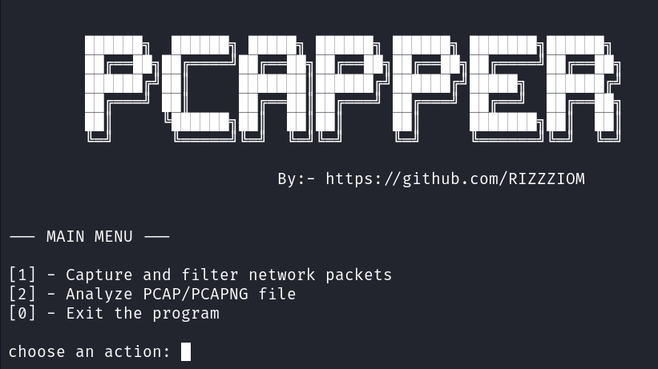
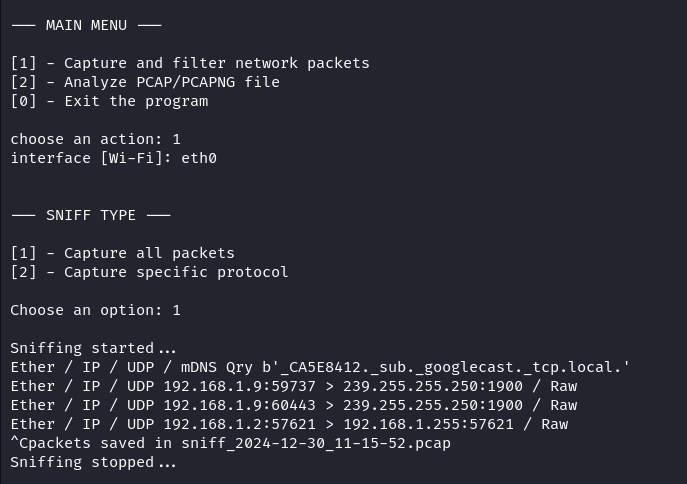
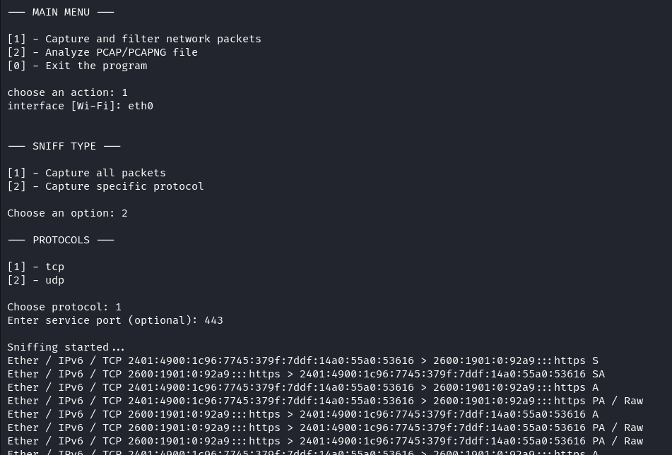
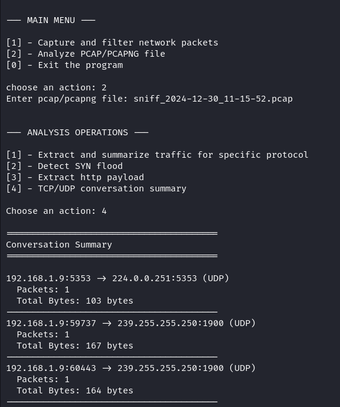

# 🛠️ PCAPPER: A Network Traffic Sniffing and Analysis Tool

Pcapper is a Python-based tool designed for learning and experimentation with network traffic capture and analysis. 📡 Built with simplicity and functionality in mind, it allows users to sniff network traffic and analyze capture files with powerful features. Whether you're exploring protocols, detecting SYN flood attacks, or extracting HTTP payloads, Pcapper has you covered! 🚀

# ✨ Features

- 📡 **Sniff Network Traffic**:    
    - Capture and filter packets directly from the network.

- 🔍 **Analyze Capture Files**:    
    - Extract and summarize traffic for a specific protocol.
    - Detect potential SYN flood attacks.
    - Extract HTTP payloads.
    - Generate detailed TCP/UDP conversation summaries.

- 📁 **Supported Formats**:    
    - Analyze `.pcap` and `.pcapng` files with ease.

# ⚙️ Installation

1. Clone the repository:

```bash
git clone https://github.com/RIZZZIOM/pcapper.git
cd pcapper
```

2. Install the required dependencies:

```bash
pip install -r requirements.txt
```

3. Run the tool:

```bash
python pcapper.py
```

# 🚀 Usage

Using PCAPper is simple and intuitive! Follow these steps to capture and analyze network traffic.

### 🖥️ Getting Started

- Run the tool by executing.

```shell
python pcapper.py
```

- You'll be greeted with a CLI dashboard.



### 📡 Capturing Packets

 1. **Capture All Packets**: Select the option to capture all packets from the specified network interface.



2. **Capture Traffic Of Specific Protocol**: Filter packets by specifying a **protocol** (e.g., TCP or UDP) and an optional **port**.



### 🔍 Analyzing Captured Data

- Load a previously captured file (supports `.pcap` and `.pcapng` formats).
- Choose from the following analysis options:
	- **Summarize Traffic**: Extract and summarize traffic for a specific protocol.
	- **Detect SYN Flood**: Identify potential SYN flood attacks in the data.
	- **Extract HTTP Payload**: Retrieve and view HTTP payloads from packets.
	- **Conversation Summary**: Analyze communication between source and destination IPs with packet counts and data sizes.



# 🤝 Contributing

Contributions are welcome! Feel free to fork the repo, make your changes, and submit a pull request. If you’re adding features, please try to include relevant tests, and keep things consistent with the existing style.

# 📜 License

This project is licensed under the MIT License. See the [LICENSE](LICENSE.txt) file for details.

---
